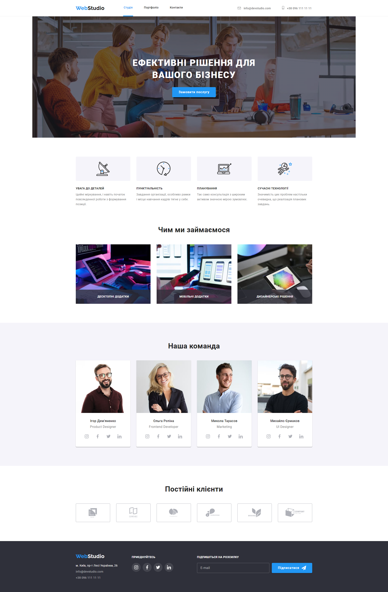
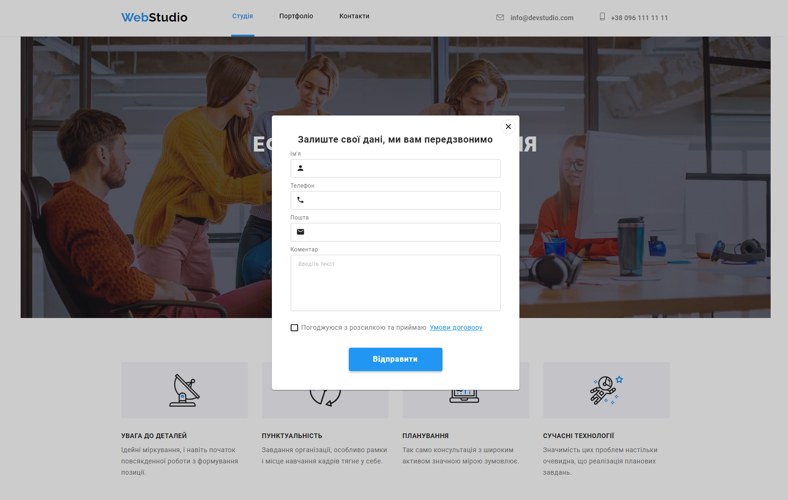
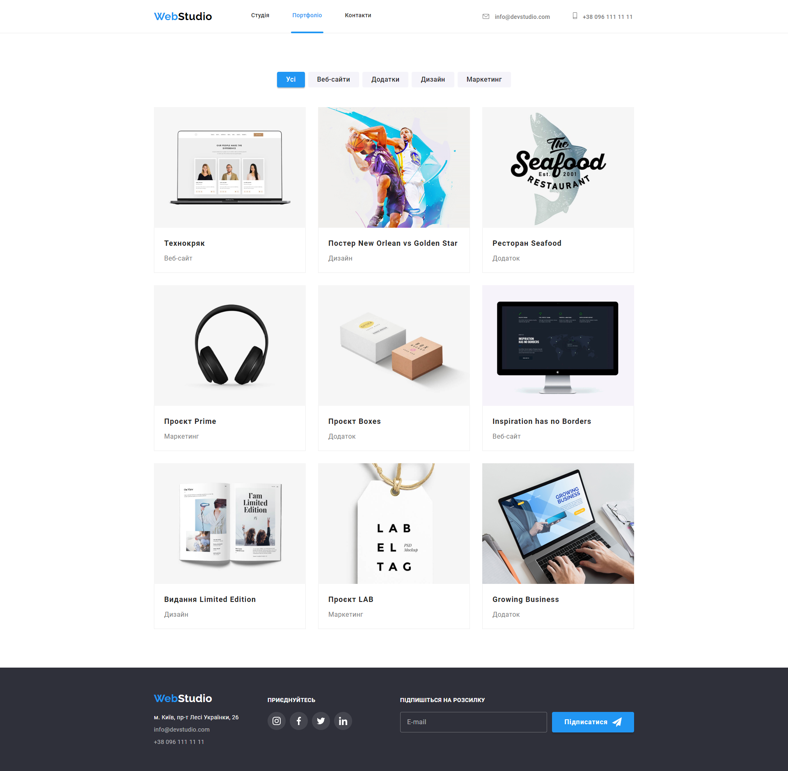
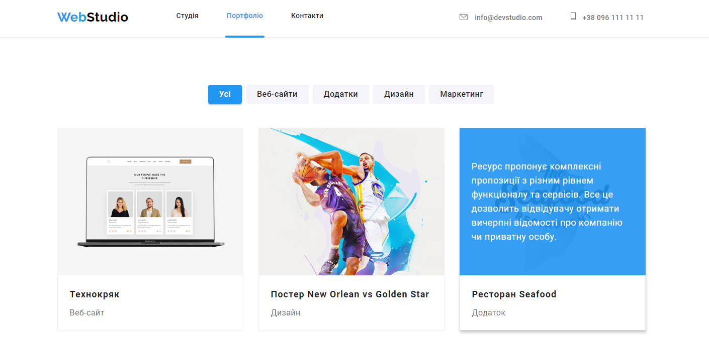
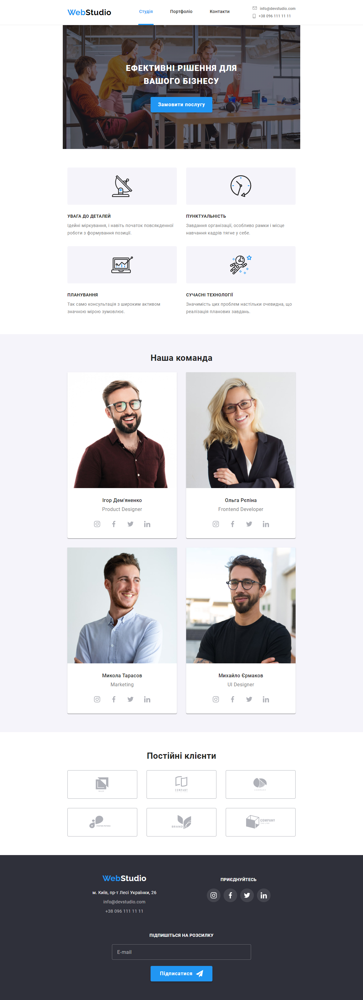
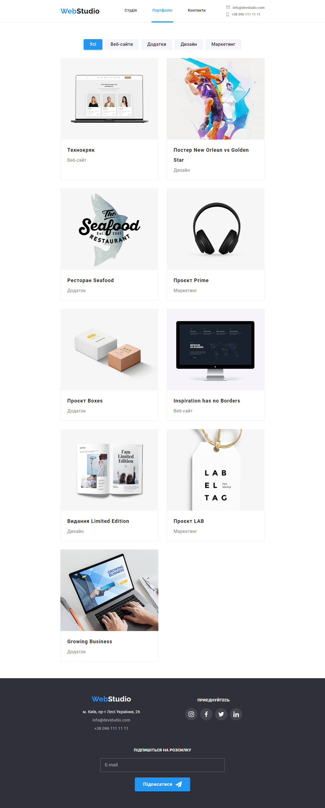
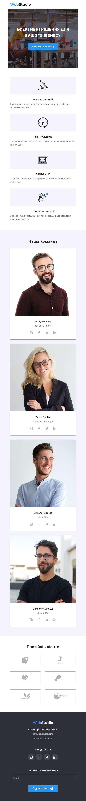
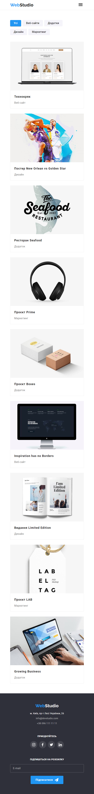
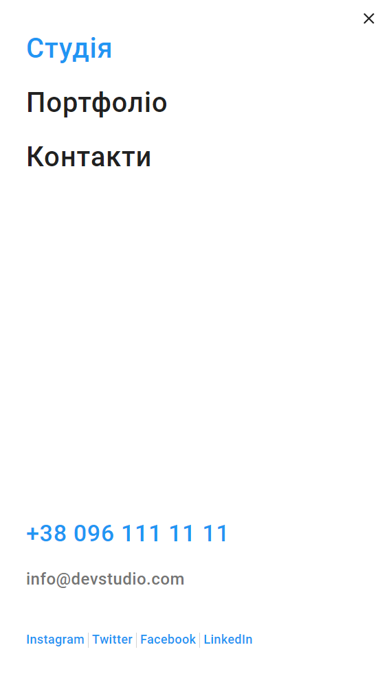

# WebStudio website

Adaptive layout of all elements of the WebStudio website
[layout](<https://www.figma.com/file/3lQQ9l3yQYngZaAsfPkRSL/Web-Studio-(Version-2.1)-(Copy)?type=design&node-id=3-7653&mode=design&t=ONsXG7em4N5EHTC6-0>),
[Studio](https://valerii2022.github.io/web-studio-ua/) and
[Portfolio](https://valerii2022.github.io/web-studio-ua/portfolio.html) pages.

## [Main Page](https://valerii2022.github.io/web-studio-ua/)

 

## [Portfolio Page](https://valerii2022.github.io/web-studio-ua/portfolio.html)

 

## Tablet WebStudio website

### Main Page

### Portfolio Page

## Mobile WebStudio website

### Main Page

### Portfolio Page

### Mobile Menu

